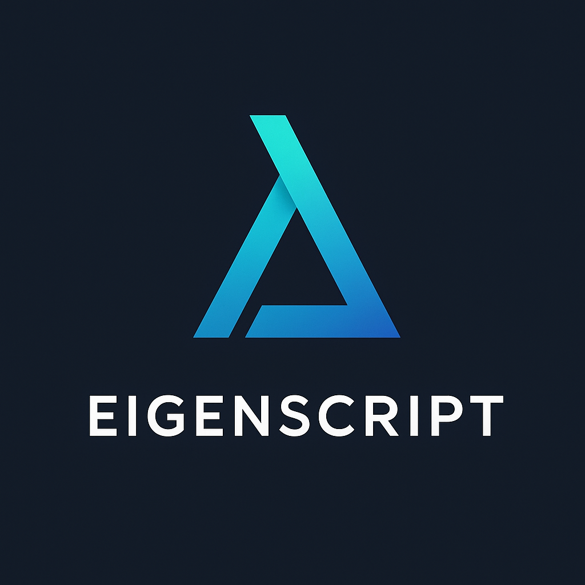

<div align="center">
  

  # EigenScript 🌀

  **The Geometric Systems Language**
</div>

EigenScript is a high-performance programming language where code is treated as a trajectory through semantic spacetime. It combines the **zero-cost abstractions** of a system language with the **geometric introspection** of a symbolic AI.


## 🚀 Key Features

* **Native Performance:** Compiles to LLVM IR and optimized machine code.
    * **Scalar Fast Path:** Unobserved variables compile to raw CPU registers (C-speed).
    * **Geometric Slow Path:** Observed variables automatically upgrade to full physics objects.
* **Geometric Semantics:** First-class support for vector embeddings, gradients (`why`), and stability metrics (`how`).
* **Zero-Cost Abstraction:** You only pay for the geometry you use. A simple loop runs in **2ms**.

## ⚡ Performance

EigenScript v0.2 introduces the **Scalar Fast Path** and **Link-Time Optimization (LTO)**, delivering massive speedups over the Python interpreter.

| Benchmark (Sum 1M) | Execution Time | Speedup |
| :--- | :--- | :--- |
| **Python Interpreter** | ~106.00 ms | 1x |
| **EigenScript (v0.1)** | ~223.00 ms | 0.5x |
| **EigenScript (v0.2)** | **2.00 ms** | **53x** ⚡ |

*Benchmark run on `examples/benchmarks/loop_fast.eigs` using `-O2` optimization.*

## 🌌 The "Observer Effect" Compiler

EigenScript uses a unique compiler architecture that behaves like a quantum observer:

1.  **Unobserved Code:** If you write standard logic (`x = x + 1`), the compiler generates raw `double` instructions using `alloca` and `mem2reg`. It is indistinguishable from optimized C.
2.  **Observed Code:** If you ask a geometric question (`gradient is why is x`), the compiler *promotes* the variable to a heap-allocated `EigenValue` struct with history tracking and gradient descent capabilities.

```eigenscript
# FAST PATH (Compiles to raw assembly, <10ns)
x is 10
y is x + 5

# SLOW PATH (Compiles to runtime calls, enables physics)
# The compiler detects 'why' and promotes 'y' to a tracked object
g is why is y
```

## Overview

EigenScript is a programming language where **your code can understand itself while it runs**.

Instead of blind execution, your programs can:
- Ask questions about what they're doing
- Check if they're making progress
- Automatically adapt when things go wrong
- Debug themselves without print statements

**For beginners**: Write clearer code with less boilerplate. Instead of complex checks, just ask `if converged:` or `if improving:`.

**For experts**: Every computation generates rich geometric state (convergence, curvature, trajectory) automatically. Access it through natural interrogatives or dive into the underlying math.

## 🛠️ Installation

```bash
git clone https://github.com/InauguralPhysicist/EigenScript.git
cd EigenScript
pip install -e .[compiler]
```

## 💻 Usage

**Compile and Run:**
```bash
eigenscript-compile program.eigs --exec -O2
./program.exe
```

**Interactive REPL:**
```bash
python3 -m eigenscript -i
```

## 🧠 Examples

### 1. High-Performance Iteration

```eigenscript
i is 0
sum is 0
limit is 1000000

# Compiles to a register-based loop (PHI nodes)
loop while i < limit:
    i is i + 1
    sum is sum + i

print of sum
```

### 2. Geometric Introspection

```eigenscript
x is 42
target is 50

# The compiler sees 'how' and enables stability tracking for 'x'
loop while x < target:
    x is x + 1
    
    if stable:
        print of "Trajectory is stable"
        print of how is x
```

## Core Primitives

| Primitive | Syntax | Semantic Meaning | Geometric Property |
|-----------|--------|------------------|-------------------|
| **OF** | `x of y` | Relational operator | Lightlike (‖OF‖² = 0) |
| **IS** | `x is y` | Identity/binding | Projection in LRVM |
| **IF** | `if cond:` | Conditional | Norm-based branching |
| **LOOP** | `loop while:` | Iteration | Geodesic flow |
| **DEFINE** | `define f as:` | Function definition | Timelike transformation |
| **RETURN** | `return x` | Flow termination | Observer frame projection |

## Higher-Order Functions

EigenScript supports powerful functional programming patterns with geometric semantics:

| Function | Syntax | Description | Use Case |
|----------|--------|-------------|----------|
| **map** | `map of [f, list]` | Transform each element | Apply function to all items |
| **filter** | `filter of [p, list]` | Select matching elements | Keep only items satisfying condition |
| **reduce** | `reduce of [f, list, init]` | Fold to single value | Sum, product, or custom aggregation |

```eigenscript
# Example: Filter, double, then sum
define is_positive as:
    return n > 0

define double as:
    return n * 2

define add as:
    a is n[0]
    b is n[1]
    return a + b

numbers is [-2, -1, 0, 1, 2, 3]
positives is filter of [is_positive, numbers]  # [1, 2, 3]
doubled is map of [double, positives]           # [2, 4, 6]
total is reduce of [add, doubled, 0]             # 12
```

See `docs/higher_order_functions.md` for complete documentation and `examples/higher_order_functions.eigs` for more examples.

## Mathematical Functions

EigenScript includes a comprehensive math library for scientific and engineering computations:

| Category | Functions | Description |
|----------|-----------|-------------|
| **Basic Math** | `sqrt`, `abs`, `pow` | Square root, absolute value, power |
| **Exponential/Log** | `log`, `exp` | Natural logarithm and exponential |
| **Trigonometric** | `sin`, `cos`, `tan` | Standard trig functions (radians) |
| **Rounding** | `floor`, `ceil`, `round` | Round down, up, or nearest |

```eigenscript
# Basic operations
x is sqrt of 16          # 4.0
y is abs of -5           # 5
z is pow of [2, 10]      # 1024

# Scientific computing
angle is 1.5708          # π/2 in radians
sine is sin of angle     # ≈ 1.0
logarithm is log of 2.718281828  # ≈ 1.0

# Practical example: Pythagorean theorem
a is 3
b is 4
c is sqrt of (pow of [a, 2] + pow of [b, 2])  # 5.0
```

See `examples/math_showcase.eigs` for more examples.

## What Makes EigenScript Different?

### 1. Your Code Can Ask Questions

Think of your program like a student doing homework. In most languages, the student just follows steps blindly. In EigenScript, the student can pause and ask:

```eigenscript
x is 42
y is x + 8

# Your code can ask itself questions
value is what is x        # "What's the value?" → 42
identity is who is x      # "Who am I working with?" → "x"
quality is how is y       # "How am I doing?" → metrics
direction is why is y     # "Why did this change?" → direction
```

**Six simple questions your code can ask:**
- **what** - What's the actual number/value?
- **who** - What variable am I looking at?
- **when** - What step/iteration am I on?
- **where** - Where am I in the process?
- **why** - Why did things change?
- **how** - How well is this working?

*Analogy*: Like asking a GPS "how long until we arrive?" instead of calculating it yourself.

### 2. Write How You Think

Instead of writing complicated logic, just say what you mean:

```eigenscript
# Traditional way (still works for simple stuff)
if x > threshold:
    continue

# But for complex patterns, just say it:
if converged:           # "Are we done?"
    return result

if stable:              # "Is everything OK?"
    continue_processing

if improving:           # "Are we getting closer?"
    keep_going

if oscillating:         # "Are we stuck in a loop?"
    try_different_approach
```

**Checks you get for free:**
- `converged` - "Are we done yet?"
- `stable` - "Is everything working smoothly?"
- `diverging` - "Are things getting worse?"
- `improving` - "Are we making progress?"
- `oscillating` - "Are we going in circles?"
- `equilibrium` - "Are we at a tipping point?"

*Analogy*: Like saying "Are we there yet?" on a road trip instead of checking the GPS coordinates yourself.

### 3. Smart Code That Adapts

Your program can check itself and change strategy automatically:

```eigenscript
define smart_compute as:
    result is n * 2

    # Program checks its own progress
    if oscillating:
        # "I'm going in circles - simplify!"
        return n
    else:
        if improving:
            # "I'm getting somewhere - keep going!"
            return result * result
        else:
            # "This isn't working - try something else!"
            return result + n
```

*Analogy*: Like a GPS that sees traffic ahead and automatically reroutes you. The program doesn't just follow instructions - it monitors and adapts.

### 4. Easier Debugging

No more guessing what went wrong. Just ask your code:

```eigenscript
loop while counter < 100:
    counter is counter + 1

    # Instead of print statements everywhere...
    if not stable:
        # Just ask what's happening:
        current_value is what is counter       # Get the value
        change_direction is why is counter     # See why it changed
        process_quality is how is counter      # Check if it's working well
```

*Analogy*: Like your car showing "Check Engine" with specific details, instead of just a blinking light.

### Why This Matters

**For beginners:**
- Less code to write
- Clearer code to read
- Easier to debug
- Programs that explain themselves

**For everyone:**
- Code adapts automatically when things go wrong
- Natural language instead of complex logic
- Built-in progress monitoring
- Self-documenting behavior

**The bottom line:** Your programs understand themselves, so you don't have to micromanage every detail.

---

### For the Technically Curious

*You don't need to know this to use EigenScript, but if you're wondering "how does this work?"...*

Behind the scenes, every operation generates geometric state: convergence metrics, trajectory curvature, framework strength. The interrogatives and predicates are just friendly interfaces to this rich mathematical structure.

The math comes from a simple idea: measure the "distance" between where computation is and where it was (`I = (A-B)²`). From that one measurement, you get convergence, stability, direction, quality - everything.

*Think of it like:* A car's dashboard shows speed, fuel, temperature. You don't need to understand the sensors. But they're all reading from the same engine data. EigenScript is similar - rich data underneath, simple questions on top.


## 📚 Documentation

**Full Documentation**: [https://inauguralphysicist.github.io/EigenScript/](https://inauguralphysicist.github.io/EigenScript/)

- Quick Start Guide
- Language Specification  
- API Reference (48+ functions)
- Example Gallery (29+ programs)
- Tutorials & Guides

### 🗺️ Roadmap

**Current Status:** Phase 5 (Interactive Playground) ✅ Complete

Phase 5 achievements:
- Web-based Interactive Playground (EigenSpace)
- Real-time compilation and visualization
- Split-screen IDE with animated canvas
- 100% test pass rate (665/665 tests)

Previous achievements:
- **Phase 3:** Architecture-agnostic compilation (WASM, ARM64, x86-64)
- **Phase 3:** 53x performance improvement with Scalar Fast Path

**Next Up:** Phase 6 (Language Features) - [See detailed roadmap](ROADMAP.md)
- Module system with imports/exports
- Type annotations for stricter safety
- Pattern matching and async/await
- Enhanced standard library

[View complete roadmap →](ROADMAP.md)


## Why EigenScript?

### The Beginner-Friendly Answer

Most programming languages make you track everything manually:
- Is my loop stuck?
- Is my recursion going to crash?
- Why is this slow?
- What went wrong?

EigenScript tracks these things for you. Your code can check itself and adapt.

### The Technical Answer

Traditional languages execute blindly - recursion can spiral into infinite loops, and you have no built-in way to detect convergence or stability.

EigenScript computes geometric state during execution:
1. **Self-interrogation**: Code can query its own execution state
2. **Automatic convergence detection**: Knows when computations have settled
3. **Stable self-reference**: Self-referential code converges instead of exploding
4. **Built-in progress metrics**: Framework Strength, stability, trajectory analysis

## Example: Safe Self-Reference

In most languages, a function calling itself with itself causes crashes or infinite loops. Not in EigenScript:

```eigenscript
# A function that looks at itself looking at itself
define observer as:
    meta is observer of observer  # Doesn't explode - converges!
    return meta

result is observer of null
print of result  # Returns stable result, not infinite loop
```

**What's happening?** The language detects when the recursion reaches a stable state and stops automatically. No manual loop counter, no stack overflow.

*Beginner takeaway*: You can write self-referential code without crashes.

*Expert detail*: The `OF` operator has geometric properties that create stable fixed points at the "lightlike boundary". Self-reference converges to eigenstates instead of diverging.


## 🤝 Contributing

We welcome contributions! See [CONTRIBUTING.md](CONTRIBUTING.md) for guidelines.

## 📜 License

MIT License. See [LICENSE](LICENSE) for details.

---

**Author**: J. McReynolds  
**Email**: inauguralphysicist@gmail.com  
**Twitter/X**: [@InauguralPhys](https://twitter.com/InauguralPhys)
